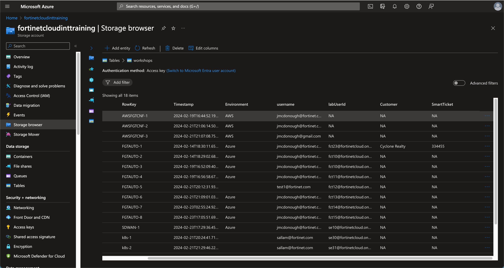
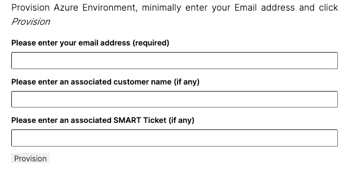

# Fortinet OnDemand Labs - Lab Provisioning and Usage Tracking

This repository contains Azure Runbooks and Lab definitions to manage Azure based Lab Environments and to track Azure and Non-Azure based Lab ***Enrollment***.

These lab environments are utilized for internal and external training events.

Lab environments are defined, managed, and tracked through Azure Automation. Lab ***progress*** is monitored via Google Analytics.

## Components

The process consists of several components

- **Azure Automation Account**

- **Azure Runbooks**
  - ManageTrainingUser.ps1 - Tracks lab Enrollment and Provisions a lab environment (if Azure based)
  - ManageTrainingEnvs.ps1 - Deprovisions lab environments after the lab duration has expired
    - Runs Hourly: deletes/deprovisions Labs and Users from Azure when lab duration has been exceeded

- **Azure Storage Account**
  - Storage Container
    - File staging, files that may be required when a lab is provisioned
    - Lab definition files - explained further below

  - Storage Table - A non-relation structured data table (AKA NoSQL) used to store lab enrollment data
    - Captured fields
      - Timestamp: Date and Time lab in launched
      - Environment: AWS, Azure, GCP, etc.
      - username (Email Address): Email address of requestor
        - Lab details email (if any) is delivered to this address
        - Domain of Email may allow or restrict provisioning of lab
      - labUserId: Azure account Id to access lab environment
      - Customer: Name of Customer (if any) related to this lab utilization
      - SmartTicket: Smart Ticket Number (if any) related to this lab utilization

- **Azure Vault**
  - Stores support values: domains, subscriptions, api keys, etc.

## Lab Environment Definitions

Lab environments are defined in an JSON structured file that indicates multiple aspects of the Lab.

Labs can be one of two types

- Azure Provisioned Environments
- All Other Environments

### Azure Provisioned Environments

Azure Provisioned Environments are defined in a JSON structured file containing attributes whose values are used to manage user accounts and resources. Lab definition files are stored in the above described Azure Storage Account.

The Azure Runbook ***ManageTrainingUser.ps1***, retrieves the requested lab definition file from the Storage Account and processes the request based on the attributes in the lab definition file.

> Azure and non-Azure lab environments will always create a Lab enrollment record in the above described Azure Storage Table. For a non-Azure environment after the enrollment record is created no other actions are performed.

#### Azure Lab Definition Attributes

Lab provisioning and enrollment tracking is done via an Azure Runbook and Azure Storage Table. Lab definition attributes must minimally indicate Provider Environment and Lab Name. The attributes *fortiLabEnv* and *fortiLabName* are used to create a Lab enrollment record in the Storage Table described in the Azure Components. When Azure is specified as the provider, additional attributes are required to define the resources to provision for the lab.

Azure lab definition attributes describe the lab name, restricted requestor domains (if any), number of allowed users, username prefix, Azure Tenant where lab is provisioned, duration of lab, and all lab required resources.

The lab definition shown below describes a lab environment that can be provisioned for up to 30 users. Usernames are a combination of the next available number in the Id Range and the username prefix. For example, in the definition below usernames fortilab21 - fortilab50 would be available for provisioning. The username combined with the Tenant Domain provides a login account for Azure. The Azure login account is temporary and will be removed when the lab duration has been reached.

A lab request from a user in an allowed domain will receive an email with their Azure login credentials. The Azure login account will only have access to the Resource Group(s) described in the lab definition. Users provisioning the same lab will not have access to other user's environments, unless an Administrator provider a user access to interact with other environments. Access to other users' environments is managed through Azure IAM roles

| Attribute | Value | Description |
|---|---|---|
| fortiLabEnv           | Azure                                                    | Provider Environment                                              |
| fortiLabName          | FORTILAB                                                 | Lab Name, Must be Unique                                          |
| fortiRestricted       | ["fortinet.com", "fortinet-us.com", "concourselabs.com"] | List Email Domains Lab is Restricted to, empty means all allowed  |
| userIdNumberRange     | 21:50                                                    | Lab User ID Range - is combined with userNamePrefix               |
| userNamePrefix        | fortilab                                                 | Lab User ID Prefix - with range 21:50, fortilab21 - fortilab50    |
| userTenantDomain      | tenant-01                                                | Key mapped to deployment Tenant in Azure Vault                    |
| labDuration           | 6                                                        | Number of lab duration days, when passed lab is deleted           |
| userResourceGroups    | List of Resource Group definition Attributes             | List of Resource Groups and resources to provision                |
| - suffix              | workshop-fortilab                                        | Combined with username to create Resource Group name              |
| - location            | eastus                                                   | Azure Region                                                      |
| - storage             | true                                                     | Create Storage Account in Resource Group                          |
| - sharename           | cloudshellshare                                          | Name of File share to create in Storage Account                   |
| - bastion             | true or false                                            | Create Bastion Host in Resource Group                             |
| - utilityVnetName     | vnet-utility                                             | Azure Virtual Network Name                                        |
| - utilityVnetCIDR     | 192.168.100.0/24                                         | Azure Virtual Network Address Space                               |
| - utilitySubnetName   | utility                                                  | Azure Virtual Network Subnet Name                                 |
| - utilitySubnetPrefix | 192.168.100.64/26                                        | Azure Virtual Network Subnet Address Space                        |
| - bastionSubnetName   | AzureBastionSubnet                                       | Azure Virtual Network Bastion Subnet - must be AzureBastionSubnet |
| - bastionSubnetPrefix | 192.168.100.0/26                                         | Azure Virtual Network Bastion Subnet Address Space                |

```json
{
  "fortiLabEnv": "Azure",
  "fortiLabName": "FORTILAB",
  "fortiRestricted": ["fortinet.com", "fortinet-us.com", "concourselabs.com"],
  "userIdNumberRange": "21:50",
  "userNamePrefix": "fortilab",
  "userTenantDomain": "tenant-01",
  "labDuration": "6",
  "userResourceGroups": [
    {
      "suffix": "workshop-fortilab",
      "location": "eastus",
      "storage": true,
      "sharename": "cloudshellshare",
      "bastion": true,
      "utilityVnetName": "vnet-utility",
      "utilityVnetCIDR": "192.168.100.0/24",
      "utilitySubnetName": "utility",
      "utilitySubnetPrefix": "192.168.100.64/26",
      "bastionSubnetName": "AzureBastionSubnet",
      "bastionSubnetPrefix": "192.168.100.0/26"
    },
    {
      "suffix": "utility-fortilab",
      "location": "westus",
      "storage": false,
      "bastion": false
    }
  ]
}
```

### All Other Environments

These two attributes fortiLabEnv and fortiLabName are used to create a Lab enrollment record in the Storage Table described in the Azure Components. However, any user and or user environment provisioning is managed by an external process, for example, AWS Qwick Labs

```json
{
  "fortiLabEnv": "AWS",
  "fortiLabName": "AWSFGTCNF"
}
```

## Lab Enrollment Tracking

An Azure Storage Table is utilized to track lab enrollments. Each lab request creates an enrollment record as described earlier in this document.

An Azure lab can be provisioned by the same user multiple times, each time a request is received, lab availability is determined. If an available user in the Id Range is found, a lab will be provisioned.  This ability allows an instructor to pre-provision lab environments or a single user to run the lab more than once at the same time.



### Utilizing Lab Provisioning and Enrollment

The current standard for lab documentation is [Hugo](https://gohugo.io/). Hugo is a open-source static site generator framework for building websites using Markdown.

Standardizing on Hugo's standard directory structure allows for lab documentation to be produced and updated with ease. Each directory has a defined role for how Hugo will utilize the content in the directory.

Using Hugo's ***layouts/shortcodes*** directory, lab documentation can incorporate various aspects of websites that may require a specialized handling outside the scope of Hugo supported capabilities.

The ***layouts/shortcodes*** directory ofr lab documentation is used to store a html script and form code to call to the Lab Provisioning and Enrollment as part of the lab utilization process. The code is structured to be as generic as possible requiring minimal changes for each lab's documentation. The file *launchdemoform.html* in ***layouts/shortcodes*** only requires that the value of ```var labdefinition``` be set to the basename of the lab definition file in the Azure Storage account.

To pass the basename of the lab definition file in Hugo, when referencing the *launchdemoform.html* set the value of the **labdefinition** parameter. The code in *launchdemoform.html* uses the Hugo **.Get** operator to set the variable to the passed parameter value.

### Adding launchdemoform.html to Lab Documentation

***launchdemoform.html*** can inserted into any Hugo Markdown document as shown below

```html

```

```html
<script>
  function formSubmit() {

    var labdefinition = "{{ .Get `labdefinition` }}";

    var customer = document.getElementById("customer").value;
    var smartticket = document.getElementById("smartticket").value;
    var useremail = document.getElementById("useremail").value;

    var postdata =
      "customer=" + customer + "&smartticket=" +  smartticket + "&useremail=" + useremail + "&userop=Create&odlconfigname=" + labdefinition;

    var xhr = new XMLHttpRequest();
    xhr.open(
      "POST",
      "https://link-to-azure-automation-webhook",
      false
    );
    xhr.setRequestHeader("Content-type", "application/x-www-form-urlencoded");
    xhr.onreadystatechange = function () {
      if (this.readyState == 4 && this.status == 200) {
        var json = eval("(" + this.responseText +")");
        alert("Success. Result:" + json);
      }
    };
    xhr.onload = function () {
      console.log(this.responseText);
    };

    xhr.send(postdata);

    document.getElementById("useremail").getElementsByTagName("input")[0].value = 'Provisioning Started.';
    return false;
  }
</script>

<form id="provision-lab" onsubmit="return formSubmit();">
  <label for="useremail">Please enter your email address (required)</label>
  <input type="email" required id="useremail" name="useremail" value="" />
  <label for="customer">Please enter an associated customer name (if any)</label>
  <input type="text" id="customer" name="customer" value="" />
  <label for="smartticket">Please enter an associated SMART Ticket (if any)</label>
  <input type="text" id="smartticket" name="smartticket" value="" />
  <input type="submit" value="Provision" />
</form>
```

Contents of ***launchdemoform.html*** will be inserted into the html page when the Hugo process renders the page.

## Resulting Document


